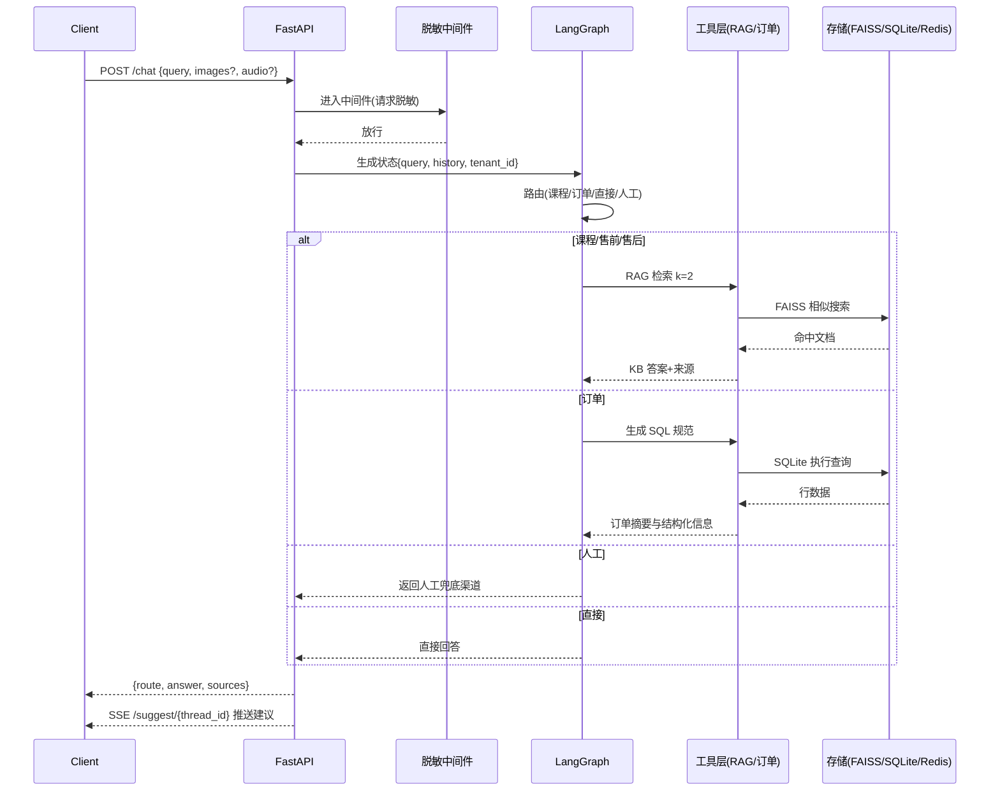
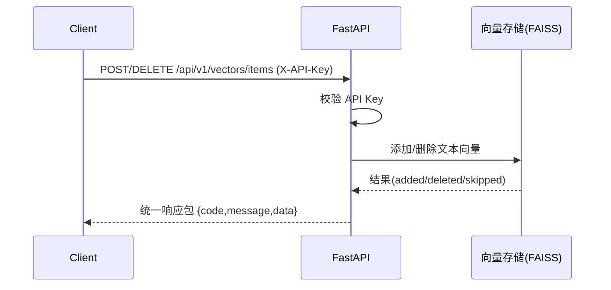

# 架构设计文档

## 概述
- 系统定位：基于 FastAPI + LangGraph 的智能客服与业务查询系统，支持 RAG 检索、订单查询、多租户隔离、建议问题推送与日志审计。
- 主要能力：
  - 对话路由（课程咨询/订单查询/直接回答/人工兜底）
  - RAG 知识库检索（FAISS 向量库，多租户隔离）
  - 订单数据库查询（SQLite）
  - 建议问题异步推送（SSE）
  - 日志与指标采集（文件落地 + `/health` 指标快照）

## 组件图

```mermaid
flowchart LR
    subgraph Client
        W[Web 前端/调用方]
        G[Gradio 页面]
        MCP[MCP 客户端]
    end

    W -->|HTTP/JSON| API[FastAPI 应用]
    G --> API
    MCP --> API

    subgraph API 层
        MID[安全脱敏中间件\nRedactionMiddleware]
        ROUTES[/chat /health /models/*\n/api/v1/vectors/* /api/orders/* /greet /suggest]
    end
    API --> MID
    MID --> ROUTES

    subgraph 对话引擎
        LG[LangGraph 状态图]
        RT[路由 LLM]
        SQL[SQL LLM]
    end
    ROUTES --> LG
    LG --> RT
    LG --> SQL

    subgraph 工具层
        RAG[RAG 检索工具]
        ORD[订单查询工具]
        SUG[建议问题生成]
    end
    LG --> RAG
    LG --> ORD
    LG --> SUG

    subgraph 存储与资源
        VS[(FAISS 向量库)]
        DB[(SQLite 订单库)]
        SUP[(support.db 未命中库)]
        REDIS[(Redis 会话存储 可选)]
        TEN[多租户资源目录]
        LOGS[(requests.log 指标/审计)]
    end
    RAG --> VS
    ORD --> DB
    LG --> REDIS
    API --> LOGS
    TEN --- VS
    TEN --- DB
    TEN --- datas
```

## 数据流图

### 对话请求（/chat）


### 向量库管理（/api/v1/vectors/items）


## 技术选型
- Web 框架：`FastAPI`（高性能 ASGI、类型友好、生态完善）
- 对话编排：`LangGraph`（有状态、有检查点、节点化的工作流）
- LLM 接入：`langchain_community.ChatTongyi`（DashScope Qwen 系列，含结构化输出）
- 向量检索：`FAISS`（本地高效检索，支持租户独立索引）
- 数据库：`SQLite`（轻量、易运维；每租户独立库）
- 会话存储：`Redis`（可选，无则降级内存）
- UI 集成：`Gradio`（挂载订单浏览页面）
- 事件推送：`SSE`（建议问题异步推送）
- 审计与监控：文件日志 `work/logs/requests.log` + 指标快照 `/health`
- 部署编排：`docker-compose`（可选 Redis，健康检查）

## 设计原则
- 安全与隐私优先：统一脱敏中间件，日志仅保存必要信息；API Key 保护写入接口。
- 简单可依赖：本地化 FAISS 与 SQLite，降低外部依赖；Redis 可选。
- 可观察性：统一耗时统计、多维指标分类（overall/kb/order/direct/handoff/vectors_*）。
- 多租户隔离：目录级资源隔离（索引/数据/文件），请求头或参数选择租户。
- 可扩展性：LangGraph 节点化设计，便于新增意图与工具；LLM 可热切换。

## 关键决策点
- LLM 结构化输出：路由与 SQL 生成都采用结构化模式，强化可控性与安全性。
- SQL 安全校验：工具层在执行前校验占位符、表名、列名，避免注入与越权。
- 索引持久化策略：优先 ASCII 路径临时保存，解决非 ASCII 路径带来的兼容性问题。
- 兜底策略：知识库未命中记录到 `support.db`，触发人工渠道，保障体验。
- 模型切换：提供 `/models/switch`，即时切换并刷新 LangGraph 链。

## 多租户设计
- 选择与传递：通过 `X-Tenant-ID` 或 `?tenant=` 标识租户；默认 `default`。
- 资源布局：`tenants/<tid>/faiss_index | db/orders.sqlite | datas/`。
- 缺省拷贝：租户库缺失时从基线复制，保障最小可用。
- 课程映射：`tenant_courses.json` 维护课程到租户的映射，工具层提供聚合函数。

## 安全与合规
- 内容脱敏：`RedactionMiddleware` 对 `application/json` 的请求与响应进行敏感字段/模式替换。
- 鉴权与授权：向量库管理需 `X-API-Key: test`；其余接口使用请求 ID 与审计跟踪。
- 最小日志：日志记录最小必要信息；严禁写入明文凭据。

## 运维与监控
- 健康检查：`GET /health` 返回模型名、KB 可用性、订单库存在性与各类指标快照。
- 日志推送：`work/log_push.py` 将 `requests.log` 以 NDJSON 推送至 ELK/Logstash，支持断点续传与鉴权。
- 指标类别：`overall/kb/order/direct/handoff/vectors_add/vectors_delete`。

## 关联文档
- 部署说明：参见《[deployment_guide.md](./deployment_guide.md)》
- API 规范：参见《[api_specification.md](./api_specification.md)》
- 性能报告：参见《[performance_report.md](./performance_report.md)》