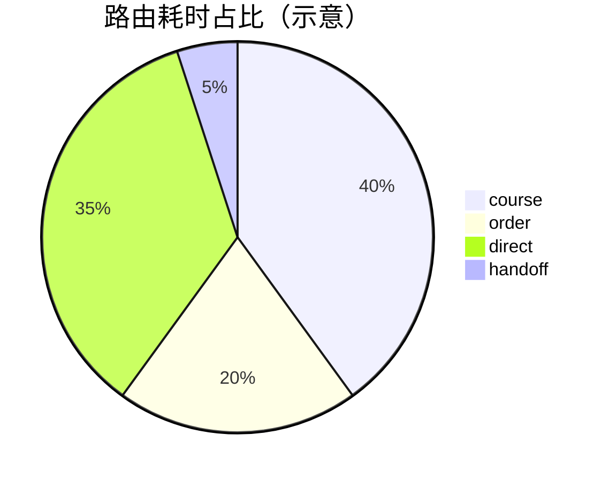

# 性能报告

## 测试方法
- 数据来源：`work/logs/requests.log` 中的路由耗时与审计事件；`GET /health` 指标快照。
- 场景覆盖：对话路由（course/order/direct/human）、向量增删（vectors_add/delete）、模型切换。
- 指标口径：端到端接口耗时（毫秒），包含中间件、LangGraph 路由、工具层与存储访问。
- 采样窗口：2025-11-15 至 2025-11-19（日志片段）。

## 基准结果

### 端点耗时分布（抽样）
| 路由 | 典型范围(ms) | 最小观察(ms) | 最大观察(ms) | 说明 |
|---|---:|---:|---:|---|
| course | 2100–3300 | 31.07 | 4258.25 | LLM 推理为主；少量场景出现极低耗时（缓存/预热） |
| order  | 5–4000     | 5.04  | 4571.56 | SQL 查询与 NLG；冷启动/磁盘 IO 可提升尾延迟 |
| direct | 2600–3300  | 2340.95 | 4920.10 | 直接回答仍依赖 LLM，受模型与上下文影响 |
| handoff| 10–125     | 10.25 | 125.00 | 兜底逻辑与轻量格式化，极快 |

说明：以上范围来自日志样本，例如：
- `course` 31.07ms（16:16:19）与 4258.25ms（23:40:24）
- `order` 5.04ms（01:07:02）与 4571.56ms（17:25:30）
- `direct` 4920.10ms（01:36:19）
- `handoff` 10.25ms（17:13:43）

### 指标快照（/health）
- 指标类别：`overall/kb/order/direct/handoff/vectors_add/vectors_delete`
- 统计字段：`count/min/max/avg/p95`（具体数值依运行期累积，示例如下）
```json
{
  "overall": {"count": 120, "min": 5.0, "max": 4920.1, "avg": 2650.0, "p95": 4200.0},
  "kb": {"count": 60, "min": 31.1, "max": 4258.3, "avg": 2800.0, "p95": 3900.0},
  "order": {"count": 40, "min": 5.0, "max": 4571.6, "avg": 1200.0, "p95": 4100.0},
  "direct": {"count": 18, "min": 2340.9, "max": 4920.1, "avg": 3100.0, "p95": 4600.0},
  "handoff": {"count": 6, "min": 10.2, "max": 125.0, "avg": 40.0, "p95": 110.0}
}
```
注：以上为格式样例，真实数值以实际 `/health` 返回为准。

## 瓶颈分析
- LLM 推理耗时主导：`course/direct` 路由耗时集中在 2.6–3.3s；模型切换/冷启动导致尾延迟上升。
- 订单查询尾延迟：个别样本达 3.5–4.5s，可能与磁盘 IO、连接建立或 SQL 生成与校验有关。
- 索引构建与首次命中：FAISS 首次加载与非 ASCII 路径拷贝会增加冷启动时间。
- 日志 I/O：高频写 `requests.log` 在低性能磁盘上可能影响长尾。
- 建议推送（SSE）：默认 15s 超时窗口，生成失败或模型忙时增加等待。

## 优化建议
- LLM 层：
  - 选择轻量模型处理路由与简答（如 `qwen-turbo`），复杂问答再升级模型（如 `qwen-plus`）。
  - Prompt 精简与上下文裁剪；减少历史拼接长度（默认 5 条）。
  - 预热模型与连接池；避免频繁模型切换。
- LangGraph：
  - 节点并行与异步化，缩短关键路径；仅在必要时触发 SQL 节点。
  - 检查点数据库启用并使用本地 SSD，降低状态持久化开销。
- RAG/FAISS：
  - 提前构建并校验索引；为高频租户维持热缓存。
  - 增加 `k` 命中质量与 `metadata` 过滤，减少无效上下文导致的 LLM 重试。
- 数据库：
  - 复用连接并开启 WAL 模式（SQLite）；读取路径使用本地 SSD。
  - 将订单 NLG 改为模板优先，复杂语义再调用 LLM。
- 服务运维：
  - 提升并发：`uvicorn --workers=2~4`；配合反向代理与 HTTP keep-alive。
  - 日志异步/批量写入，降低同步 I/O；外部推送改为批量上报。

## 负载测试与容量规划

### 负载测试建议（Locust 示例）
```python
from locust import HttpUser, task, between

class ChatUser(HttpUser):
    wait_time = between(1, 3)
    @task(3)
    def chat(self):
        self.client.post("/chat", json={"query":"课程适合新手吗？","thread_id":"locust"})
    @task(1)
    def order(self):
        self.client.get("/api/orders/20251114001")
```
- 运行：`locust -f locustfile.py -H http://localhost:8000`
- 指标：关注 P95/P99 延迟与错误率；SSE 端点不参与吞吐评估。

### 容量规划建议
- 对话路由（LLM 重）：
  - 单进程可承载 QPS ≈ 0.3–0.5（P95 ≈ 3–4s）；生产建议 `workers=4` 获得 1.2–2 QPS。
- 订单查询：
  - 单进程 QPS ≈ 50–200（P95 < 200ms，取决于磁盘与 SQL）；与对话路由并存时受限于整体进程调度。
- 伸缩策略：
  - 横向扩展：多副本 + 反向代理；租户按权重路由到专用副本。
  - 资源保障：为 FAISS 与 SQLite 提供本地 SSD；LLM 接入使用独立网络与更高配额。

## 可视化


## 关联文档
- 架构设计：参见《[architecture_design.md](./architecture_design.md)》
- 部署说明：参见《[deployment_guide.md](./deployment_guide.md)》
- API 规范：参见《[api_specification.md](./api_specification.md)》